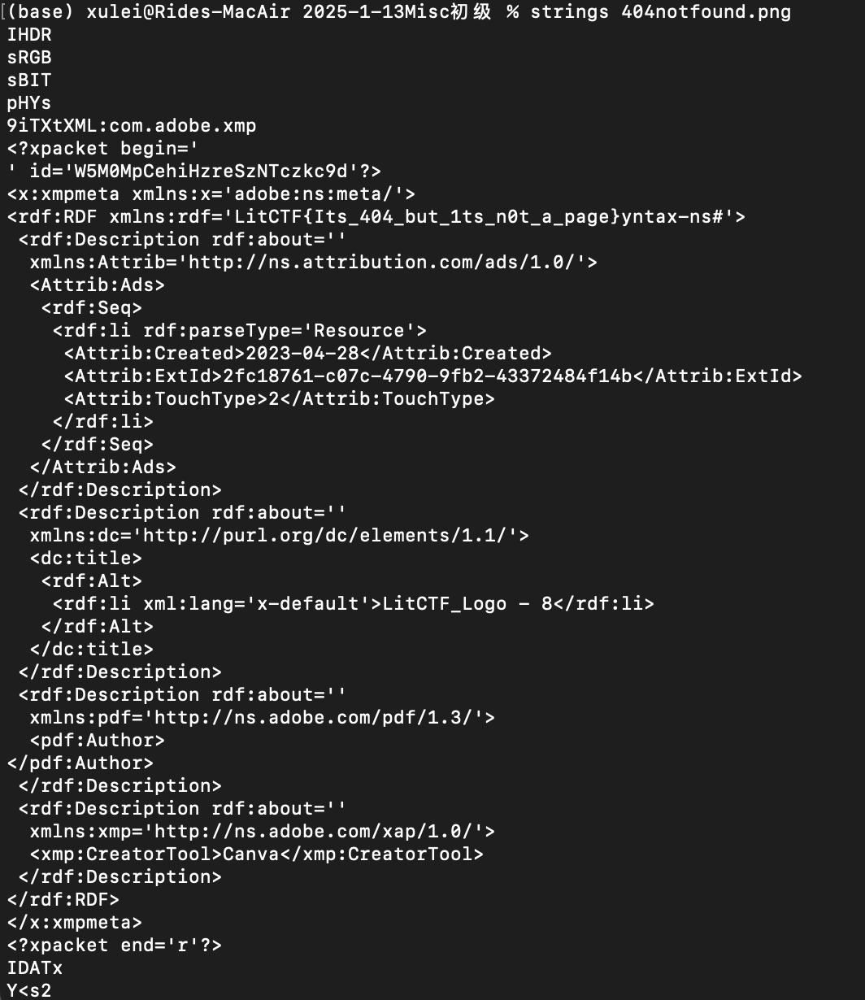
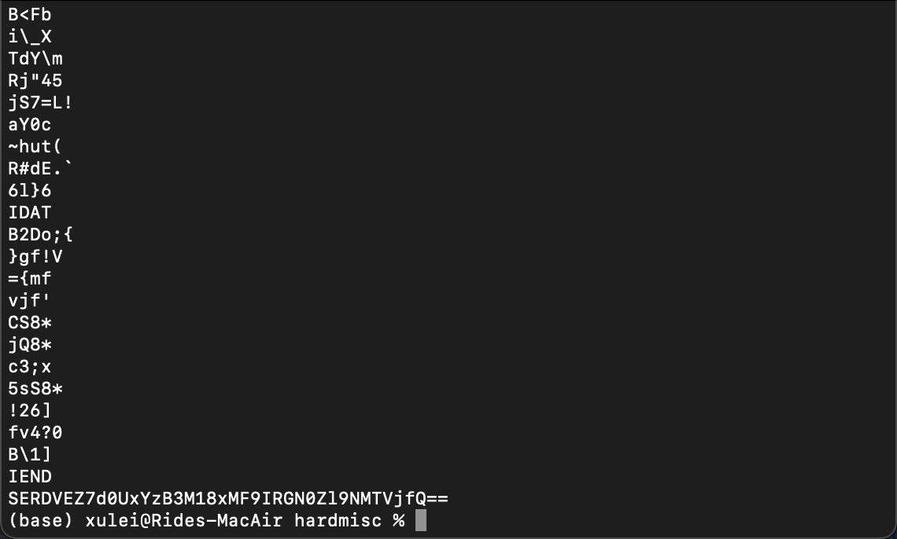
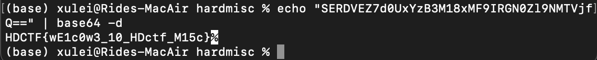
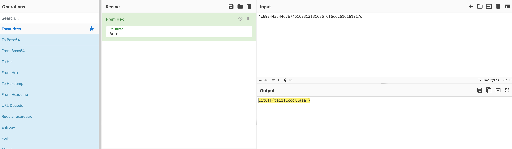
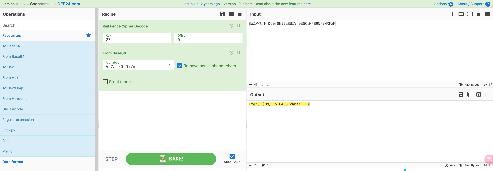
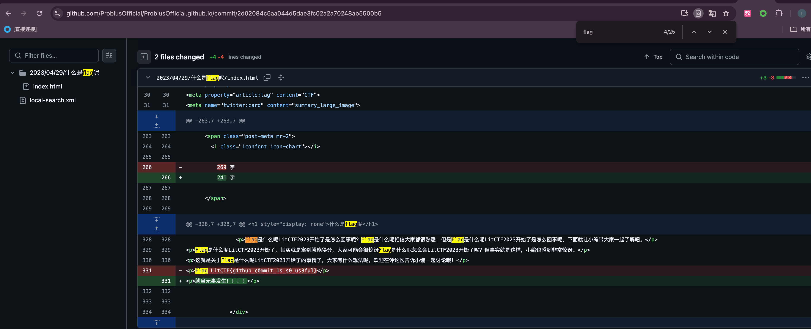

# 2025-1-13 Misc初级 Write up

## List

- [x] 10金币 [LitCTF 2023]404notfound (初级) https://www.nssctf.cn/problem/3881
- [x] 10金币 [LitCTF 2023]What_1s_BASE (初级) https://www.nssctf.cn/problem/3879
- [x] 20金币 [HDCTF 2023]hardMisc https://www.nssctf.cn/problem/3796
- [x] 10金币 [LitCTF 2023]Hex？Hex！(初级)  https://www.nssctf.cn/problem/3887
- [x] 10金币 [LitCTF 2023]Is this only base?  https://www.nssctf.cn/problem/3968
- [x] 10金币 [LitCTF 2023]就当无事发生 https://www.nssctf.cn/problem/3862

## 1. [LitCTF 2023]404notfound

### 1.1 题目描述

- 怎么又是404！还好是图片不是页面（呼~）
- 附件：一张图片

### 1.2 解答

这是一道简单的图片隐写题，主要思路是查看图片的元数据信息来寻找隐藏的flag。

1. 首先查看图片的元数据，寻找可能的线索
2. 使用strings命令查看图片中的文本信息：
   ```bash
   strings 404notfound.png
   ```
3. 查看输出结果：

   

4. 在输出的开头部分可以直接找到flag信息

### 1.3 解题答案

```
LitCTF{404_not_found_404_not_found}
```

## 2. [LitCTF 2023]What_1s_BASE

### 2.1 题目描述

- base星期四！！
- 附件：一个txt文件

### 2.2 解答

很显然直接base64解码即可，可以写代码解码，也可以使用在线解码工具。

- 这边推荐用CyberChef解码，非常方便

### 2.3 解题答案

```
LitCTF{KFC_Cr4zy_Thur3day_V_me_50}
```
- 看的出来，作者是真的饿了

## 3. [HDCTF 2023]hardMisc

### 3.1 题目描述

- can can need flag
- 附件：一张图片

### 3.2 解答

老规矩直接使用strings命令查看图片中的文本信息

```bash
strings emoji.png
```



1. 在输出的结尾部分可以找到有用信息：`SERDVEZ7d0UxYzB3M18xMF9IRGN0Zl9NMTVjfQ==`
2. 使用base64解码：

```bash
echo "SERDVEZ7d0UxYzB3M18xMF9IRGN0Zl9NMTVjfQ==" | base64 -d
```



### 3.3 解题答案

```
HDCTF{wE1c0w3_10_HDctf_M15c}
```

## 4. [LitCTF 2023]Hex？Hex！

### 4.1 题目描述

- 如果你也和我一样知道hex的话，那我觉得，这件事，太酷啦！
- 附件：一个txt文件

### 4.2 解答

提示很明显了直接Hex解码即可



### 4.3 解题答案

```
LitCTF{tai111coollaaa!}
```

## 5. [LitCTF 2023]Is this only base?  

### 5.1 题目描述

- 附件：一个txt文件

### 5.2 解答

1. 首先查看文件内容：SWZxWl=F=DQef0hlEiSUIVh9ESCcMFS9NF2NXFzM

2. 根据文本特征含两个等号，推测可以通过移位的方式得到一个base64编码的字符串，然后根据提示`今年是本世纪的第23年呢`，推测解密参数为23，使用CyberChef一把嗦，尝试多次，发现栅栏密码可以得到base64编码的字符串。

3. 使用base64解码，得到类flag：



```
IfqZQC{IbQ_Rp_E4S3_cR0!!!!!}
```

4. 猜测flag格式为`LitCTF{...}`，尝试去掉将字母全部往后推3个，得到flag：

最后一步解密代码
```python
def shift_letters(s, shift):
    result = []
    for char in s:
        if 'a' <= char <= 'z':  # 小写字母
            result.append(chr((ord(char) - ord('a') + shift) % 26 + ord('a')))
        elif 'A' <= char <= 'Z':  # 大写字母
            result.append(chr((ord(char) - ord('A') + shift) % 26 + ord('A')))
        else:  # 非字母字符
            result.append(char)
    return ''.join(result)

# 输入字符串
input_string = "IfqZQC{IbQ_Rp_E4S3_cR0!!!!!}"

# 推动 3 个字母
shifted_string = shift_letters(input_string, 3)
print("结果:", shifted_string)
```

### 5.3 解题答案

```
LitCTF{LeT_Us_H4V3_fU0!!!!!}
```

## 6. [LitCTF 2023]就当无事发生

### 6.1 题目描述

- https://ProbiusOfficial.github.io
- 差点数据没脱敏就发出去了，还好还没来得及部署，重新再pull一次（x

### 6.2 解答

1. 访问网站，发现是一个简单的网页，根据提示应该不会是访问所有页面找flag

2. 查阅信息了解到，网站的源码公开在github上，访问https://github.com/ProbiusOfficial/ProbiusOfficial.github.io

3. 由于提示中说是pull的过程中发现信息未脱敏，因此查找commit记录，查找每一条记录中与flag相关的信息，https://github.com/ProbiusOfficial/ProbiusOfficial.github.io/commits

4. 一条一条找，最终在https://github.com/ProbiusOfficial/ProbiusOfficial.github.io/commit/2d02084c5aa044d5dae3fc02a2a70248ab5500b5中找到flag信息



### 6.3 解题答案

```
LitCTF{g1thub_c0mmit_1s_s0_us3ful}
```