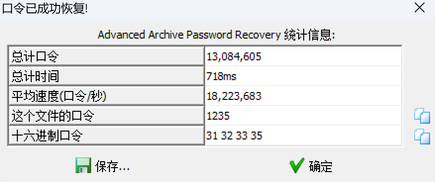

# 2025-1-15 Misc中级

## List

- [x] 10金币 [MoeCTF 2022]寻找黑客的家 https://www.nssctf.cn/problem/3314
- [x] 10金币 [MoeCTF 2022]zip套娃 https://www.nssctf.cn/problem/3313
- [x] 20金币 [FSCTF 2023]最终试炼hhh https://www.nssctf.cn/problem/4601
- [x] 10金币 [网鼎杯 2022 玄武组]misc999 https://www.nssctf.cn/problem/2572
- [x] 10金币 [SDCTF 2022]Case64AR https://www.nssctf.cn/problem/2378

## 1. [MoeCTF 2022]寻找黑客的家

### 1.1 题目描述

- 两张图片找出地理位置

### 1.2 解答

1. 首先我们看到`红荔村`这个比较特色的东西，我们用谷歌搜索发现大多这家商铺大多位于广东深圳。

2. 接着我们聚焦第一张图，看见有`汉明宫`足疗，搜索一下。发现谷歌搜索结果的第二个可能符合，点进去用百度地图的全景看一下街景。


3. 发现和题目图片吻合，得出结果。


### 1.3 答案

NSSCTF{shenzhen_longhua_qingquan}

## 2. [MoeCTF 2022]zip套娃

### 2.1 题目描述

- zip套娃娃娃
- 一个压缩包

### 2.2 解答

1. 首先我们用`7z`解压这个压缩包，发现需要密码。

2. 我们尝试爆破，记得要勾选数字。


3. 爆破成功，得到密码1235。



4. 解压得到下一层的压缩包，内有一个txt文件提示，因此我们继续爆破，但是这次需要设置范围和长度。


5. 爆破成功，得到密码1234567qwq。


6. 解压得到下一层的压缩包，内有一个txt文件提示，但是和上一层的一样，因此我们猜测是没有用的，根据经验，猜测是zip伪加密，因此打开010 editor。


7. 我们修改伪加密，将打灰部分的01改为00，然后保存，解压得到flag。


### 2.3 答案

moectf{!zip_qwq_ZIP}

## 3. [FSCTF 2023]最终试炼hhh

### 3.1 题目描述

- 一个二进制文件
- 李华早起发现现在居然是黑天！

### 3.2 解答

1. 用010 editor打开，看不出什么特征，但是我们看到文件尾的时候，看到一个倒序的flag和PK，上网搜索，发现需要先倒置才能得到zip压缩包。


2. 在网上找到一个python脚本，可以解决这个问题。

```python
input = open('flag', 'rb')
input_all = input.read()
ss = input_all[::-1]
output = open('flag.zip', 'wb')
output.write(ss)
input.close()
output.close()

```

3. 运行脚本，得到flag.zip。


4. 发现需要密码，我们查看是不是伪加密，发现是伪加密，因此我们打开010 editor，将伪加密部分改为00，然后保存，解压得到flag。


5. 解压得到一个pdf文件，毫无头绪啊，用strings一看也是没有东西，上网搜索，发现是pdf隐写，因此下载工具`wbStego4open`。


6. 使用工具，得到最后的flag，具体工具使用详见https://blog.csdn.net/Aluxian_/article/details/134199663。


### 3.3 答案

FSCTF{cmdgy_yyds}

## 4. [网鼎杯 2022 玄武组]misc999

### 4.1 题目描述

- 一个txt文件
- base

### 4.2 解答

1. 根据题目提示这是base加密，我们有了表和密文，因此根据base的加解密规则编写代码可以得到最终答案。

2. 编写代码，面向GPT编程，得到解密代码：

```python
def custom_base_decode(ciphertext, base_table):
    """
    Decode the given ciphertext using a custom base table with variable length.

    Args:
        ciphertext (str): The encoded string.
        base_table (str): The custom base table string.

    Returns:
        bytes: Decoded byte sequence.
    """
    base = len(base_table)
    if base < 2:
        raise ValueError("Base table must have at least 2 unique characters.")
    
    # Map characters in the base table to their respective values
    base_map = {char: index for index, char in enumerate(base_table)}
    
    # Convert ciphertext to an integer value using the custom base
    decoded_value = 0
    for char in ciphertext:
        if char not in base_map:
            raise ValueError(f"Character {char} is not in the base table.")
        decoded_value = decoded_value * base + base_map[char]
    
    # Convert the integer value to bytes
    byte_array = []
    while decoded_value > 0:
        byte_array.append(decoded_value & 0xFF)
        decoded_value >>= 8
    
    return bytes(reversed(byte_array))

# Example usage
base_table = "9876543210qwertyuiopasdfghjklzxcvbnmMNBVCXZLKJHGFDSAPOIUYTREWQ"  # Custom base table
ciphertext = "7dFRjPItGFkeXAALp6GMKE9Y4R4BuNtIUK1RECFlU4f3PomCzGnfemFvO"  # Encoded ciphertext

# Decode
decoded_bytes = custom_base_decode(ciphertext, base_table)
print("Decoded bytes:", decoded_bytes)
print("Decoded string:", decoded_bytes.decode('utf-8', errors='ignore'))
```

3. 运行代码，得到flag。


### 4.3 答案

flag{cf492422-13cb-4123-8bc5-5495f0349494}

## 5. [SDCTF 2022]Case64AR

### 5.1 题目描述

- Someone script kiddie just invented a new encryption scheme. It is described as a blend of modern and ancient cryptographic techniques. Can you prove that the encryption scheme is insecure by decoding the ciphertext below?
- 有人编写 Kiddie 刚刚发明了一种新的加密方案。它被描述为现代和古代加密技术的混合体。你能通过解码下面的密文来证明加密方案不安全吗？

- Ciphertext: OoDVP4LtFm7lKnHk+JDrJo2jNZDROl/1HH77H5Xv
- 密文：OoDVP4LtFm7lKnHk+JDrJo2jNZDROl/1HH77H5Xv

### 5.2 解答

1. 看名字可以联想到凯撒密码和base64两者融合，但是由于有+/，因此猜测凯撒密码的表格不是传统表格，而是base64的表格。然后在进行了凯撒密码后，需要进行base64解码。

2. 因此我们编写代码，面向GPT编程，得到解密代码：

```python
import base64

def caesar_cipher_base64(text, base_table, shift, mode="encode"):
    """
    Perform Caesar cipher encoding/decoding on a Base64 string.

    Args:
        text (str): Input text (Base64 encoded or decoded).
        base_table (str): Base64 character table.
        shift (int): Offset for the Caesar cipher.
        mode (str): "encode" for encoding, "decode" for decoding.

    Returns:
        str: Encoded or decoded text.
    """
    if mode == "decode":
        shift = -shift  # Reverse the shift for decoding

    # Map input characters through the Base64 table with the shift
    transformed_text = ""
    for char in text:
        if char in base_table:
            # Find the character index and apply the shift
            index = (base_table.index(char) + shift) % len(base_table)
            transformed_text += base_table[index]
        else:
            # Preserve characters not in the base table (e.g., padding '=' or newlines)
            transformed_text += char
    return transformed_text


# Base64 character table
base_table = "ABCDEFGHIJKLMNOPQRSTUVWXYZabcdefghijklmnopqrstuvwxyz0123456789+/"

# Input Base64-encoded string
ciphertext = "OoDVP4LtFm7lKnHk+JDrJo2jNZDROl/1HH77H5Xv"  # Replace with your text

# Loop through all possible shifts
for shift in range(1, 65):
    # Decode using the current shift
    decoded_text = caesar_cipher_base64(ciphertext, base_table, shift, mode="decode")
    try:
        # Try decoding Base64 to see if it is valid
        original_data = base64.b64decode(decoded_text).decode('utf-8', errors='ignore')
        print(f"Shift: {shift}, Decoded Base64: {decoded_text}, Original Text: {original_data}")
    except Exception as e:
        # If decoding fails, print the shifted Base64 text
        print(f"Shift: {shift}, Decoded Base64: {decoded_text} (Invalid Base64)")
```

3. 运行代码，得到flag。


### 5.3 答案

sdctf{OBscUr1ty_a1nt_s3CURITy}