# 2025-1-20 Misc初级

## 今日主题关键词

新手，MISC，取证，SQL注入

## List

- [x] 10金币 [2022蓝帽杯]手机取证1(初级) https://www.nssctf.cn/problem/2443 https://forensics.didctf.com/challenges#%E6%89%8B%E6%9C%BA%E5%8F%96%E8%AF%81_1-41
- [x] 20金币 [2023陇剑杯]Wireshark1_1 https://www.nssctf.cn/problem/6359  https://forensics.didctf.com/challenges#Wireshark1_1-552 https://forensics.didctf.com/challenges#%E7%BD%91%E7%AB%99%E5%8F%96%E8%AF%81_2-52
- [x] 10金币 [2022蓝帽杯]网站取证_2 https://www.nssctf.cn/problem/2452
- [x] 10金币 [OtterCTF 2018]General Info https://www.nssctf.cn/problem/2459
- [x] [应急响应]welog1 https://forensics.didctf.com/challenges#welog1-703
- [x] 10金币 [陇剑杯 2021]SQL注入 https://www.nssctf.cn/problem/295

检材下载地址
https://kod.cuc.edu.cn/#s/_NHKtB8w
解压密码
20250120@cuc

## 1. [2022蓝帽杯]手机取证1(初级)

### 1.1 题目描述

- 现对一个苹果手机进行取证，请您对以下问题进行分析解答。
- 627604C2-C586-48C1-AA16-FF33C3022159.PNG图片的分辨率是？（答案参考格式：1920x1080）

### 1.2 解题

1. 解压附件，然后打开其中的exe文件，呈现下图内容

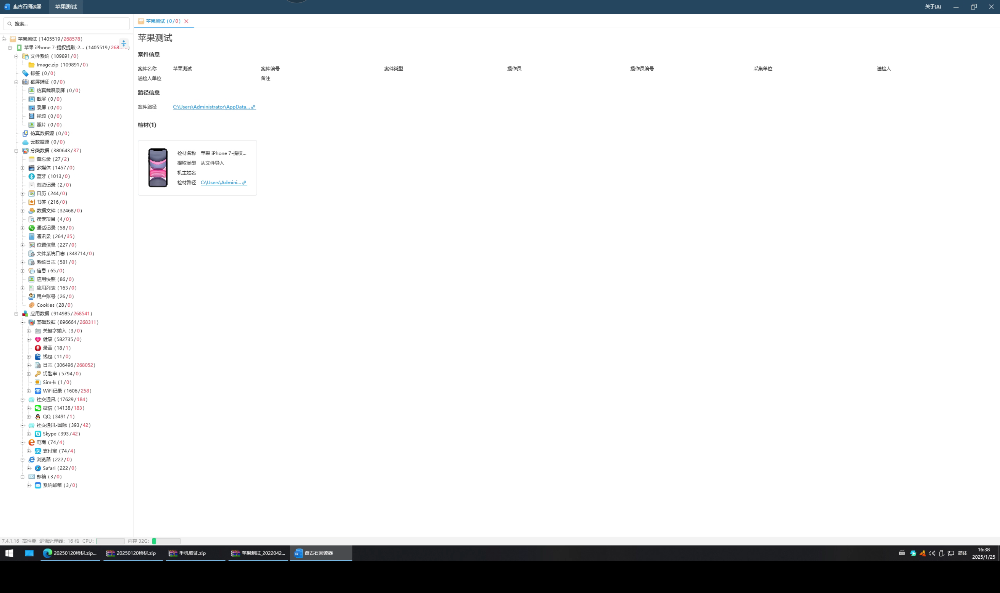

2. 直接点开搜索，输入图片信息，然后发现图片信息

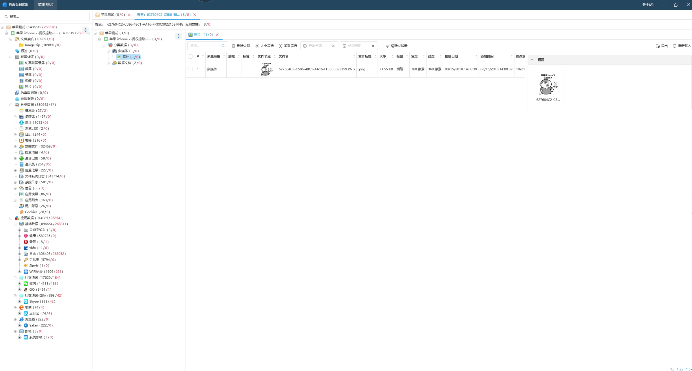

3. 得到分辨率为360x360

### 1.3 解题答案

360x360

## 2. [2023陇剑杯]Wireshark1_1

### 2.1 题目描述

- 被入侵主机的IP是？
- 一个Wireshark包

### 2.2 解题

1. 打开Wireshark包

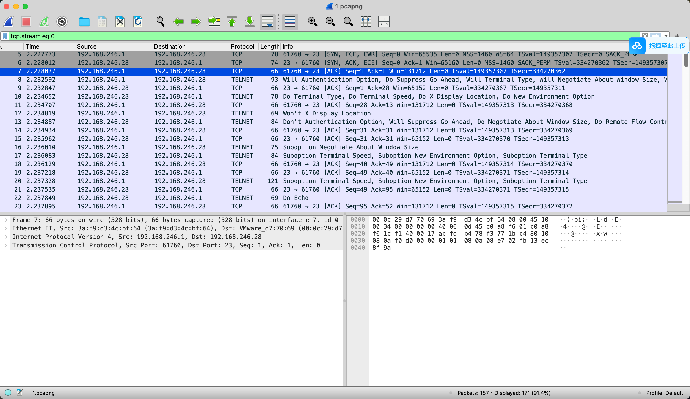

2. 看图中发现ip地址只有192.168.246.1和192.168.246.28，所以被入侵主机的ip地址是192.168.246.28

### 2.3 解题答案

192.168.246.28

## 3. [2022蓝帽杯]网站取证_2

### 3.1 题目描述

- 据了解，某网上商城系一团伙日常资金往来用，从2022年4月1日起使用虚拟币GG币进行交易，现已获得该网站的源代码以及部分数据库备份文件，请您对以下问题进行分析解答。
- 请提交数据库连接的明文密码

### 3.2 解题

- 首先我们知道对于一个网站，我们在有了网站源代码的时候，我们可以通过寻找一些配置文件找到相应服务的相关信息，比如数据库的连接信息。
- 现在我们打开附件中的源代码，然后搜索`database`，然后发现`database.php`文件中存在数据库的连接信息。

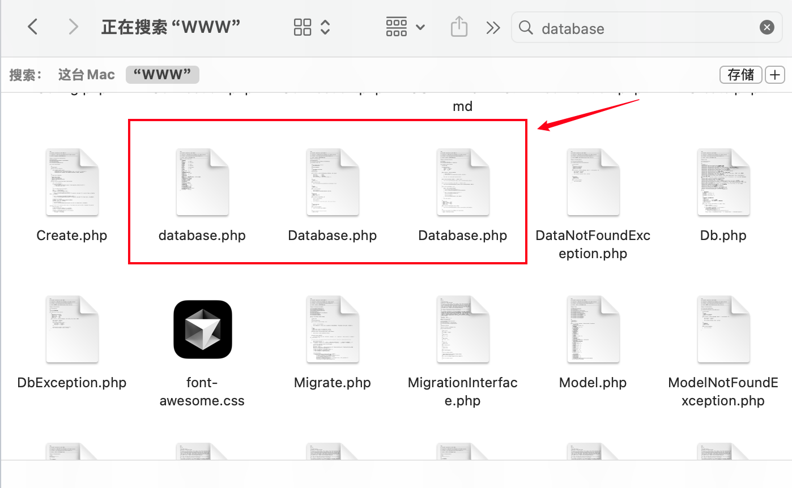

- 然后我们打开`database.php`文件，然后发现数据库的连接信息。

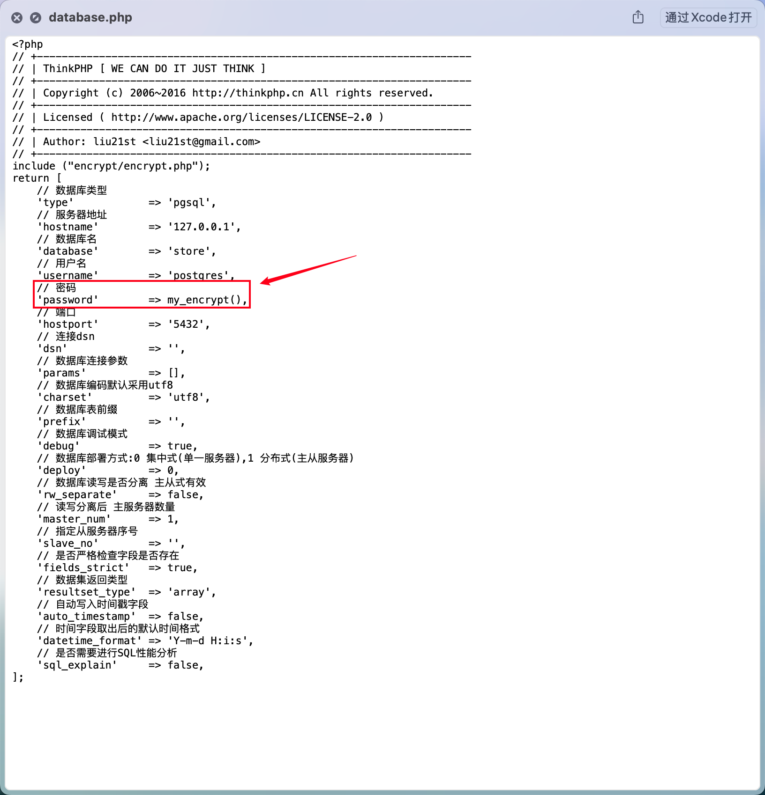

- 我们发现这是通过my_encrypt()函数的返回值得到的密码，因此我们定位这个函数并添加输出即可

- 我们通过对这个函数名的搜索找到了这个php文件，接着我们用php的编程方式添加输出。

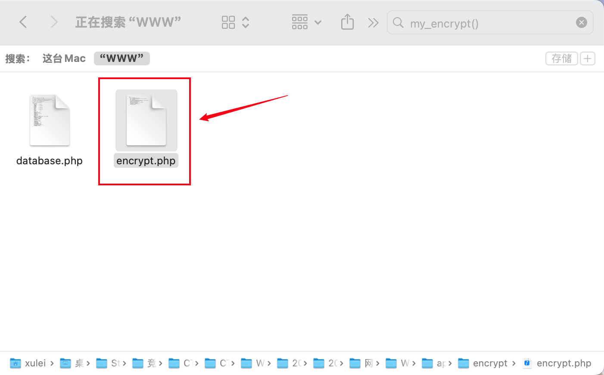
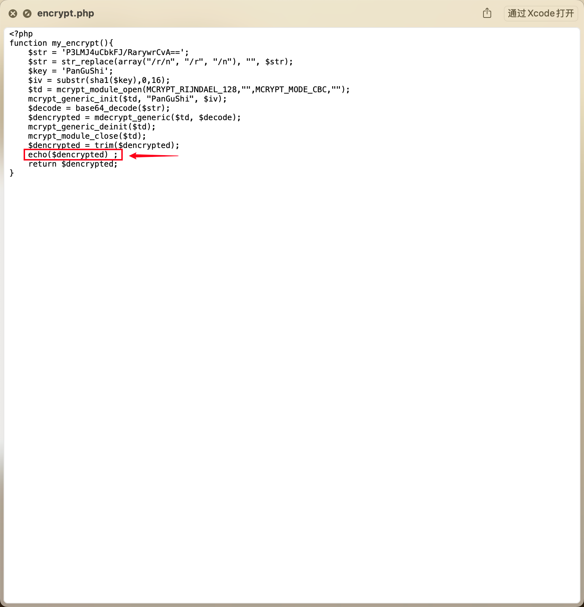

- 接着我们运行这个网站，在运行过程中我们发现一个问题，PHP 7.2 及以上已经不再自带 mcrypt，因此这个网站无法在PHP 7.2 及以上版本中运行。
- 由于我使用的是Mac，因此需要使用brew来管理包，同时使用一些操作进行PHP版本管理。
  - 管理多个php版本
    - 当我们本地有多个php的版本时，需要进行切换，可以执行以下命令，安装PHP版本切换工具

      - `brew install brew-php-switcher`

    - 安装完成后，执行以下命令就可以进行版本切换了

      - `brew-php-switcher 5.6`

- 在安装完 mcrypt 拓展后，我们运行网站得到flag。

### 3.3 解题答案

KBLT123

## 4. [OtterCTF 2018]General Info

### 4.1 题目描述

- Let’s start easy - whats the PC’s name and IP address?
- 答案使用-连接加上NSSCTF{}格式提交，例如PC名为test，IP为127.0.0.1，提交NSSCTF{test-127.0.0.1}

### 4.2 解题

- 首先我们看到附件中是一个.vmem文件，因此我们上网找工具，发现一个仓库[volatility3](https://github.com/volatilityfoundation/volatility3),然后我们下载这个仓库并按照README运行。

- 接着我们确认完这是一个Win镜像以后，我们进行进一步的分析。

- 我们使用`vol -f OtterCTF.vmem windows.registry.hivelist`命令列出注册表，然后我们知道主机名会出储存在\REGISTRY\MACHINE\SYSTEM中的ControlSet001\Control\ComputerName\ComputerName条目中

- 接着我们使用`vol -f OtterCTF.vmem windows.registry.printkey --offset 0xfffff8a000024010    --key "ControlSet001\\Control\\ComputerName\\ComputerName"`命令读取主机名，然后我们得到主机名WIN-LO6FAF3DTFE。

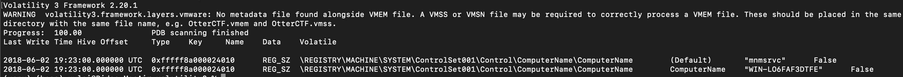

- 接着我们使用`vol -f OtterCTF.vmem windows.netscan`命令列出网络连接，然后我们得到IP地址192.168.202.131。

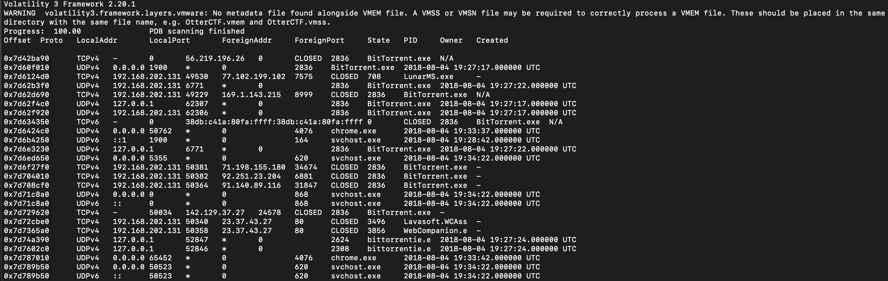

- 最后我们使用`NSSCTF{主机名-IP地址}`格式提交，然后我们得到flag。

### 4.3 解题答案

NSSCTF{WIN-LO6FAF3DTFE-192.168.202.131}

## 5. [应急响应]welog1

### 5.1 题目描述

请根据日志分析攻击者写入的木马的连接密码，提交格式为：flag{xxxxx}

### 5.2 解题

- 首先我们打开日志文件，然后由常识可知木马一般为php文件，因此我们搜索php，然后发现在登陆参数中存在php文件，因此推测这个为木马病毒。

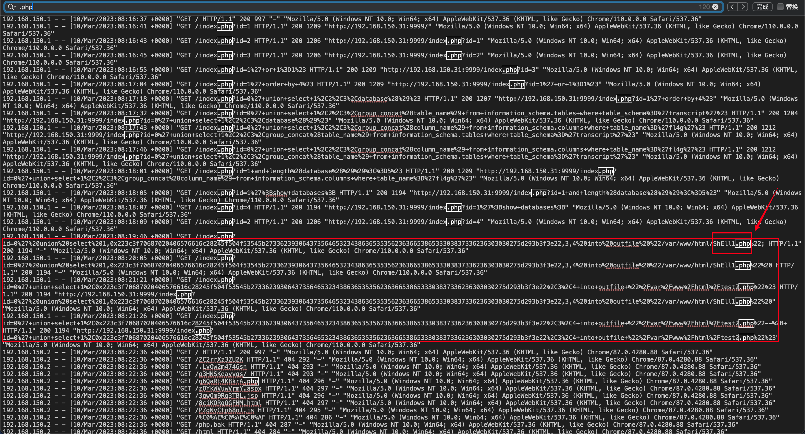

- 然后我们将这部分内容从16进制转化为字符，然后得到flag。

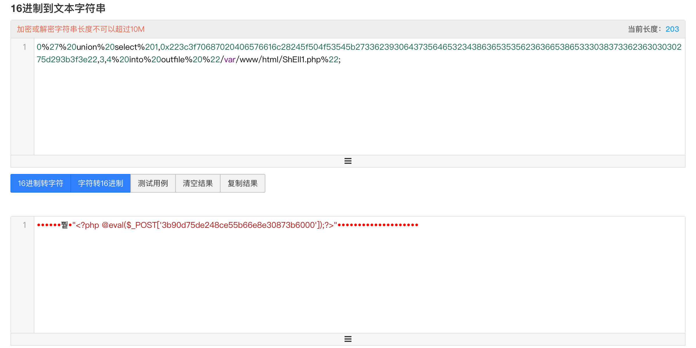

### 5.3 解题答案

flag{3b90d75de248ce55b66e8e30873b6000}

## 6. [陇剑杯 2021]SQL注入

### 6.1 题目描述

- 某应用程序被攻击，请分析日志后作答：
- 黑客最后获取到的flag字符串为_____________。得到的flag请使用NSSCTF{}格式提交。

### 6.2 解题

- 首先我们从最后往上进行分析，然后很明显这是一个SQL注入，而且根据图中红框分析，这是一个盲注

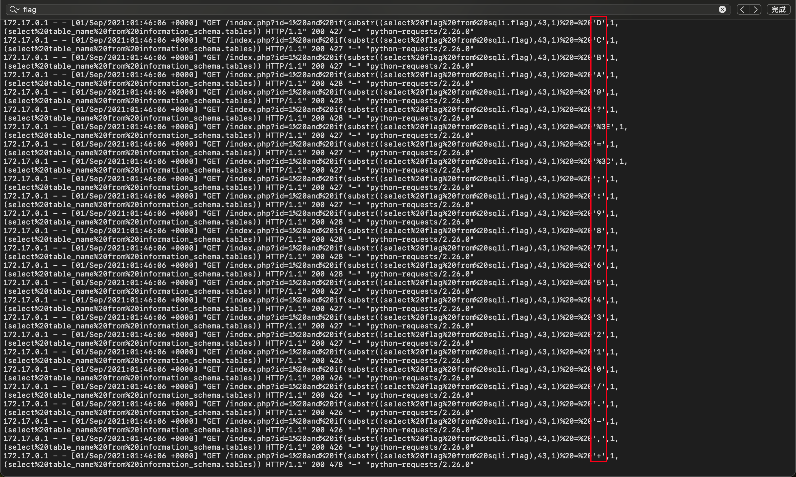

- 然后我们再往上翻发现框中位置理论上应该是c，但是现在是其他的东西，因此推测在这个位置这个d就是正确的尝试。

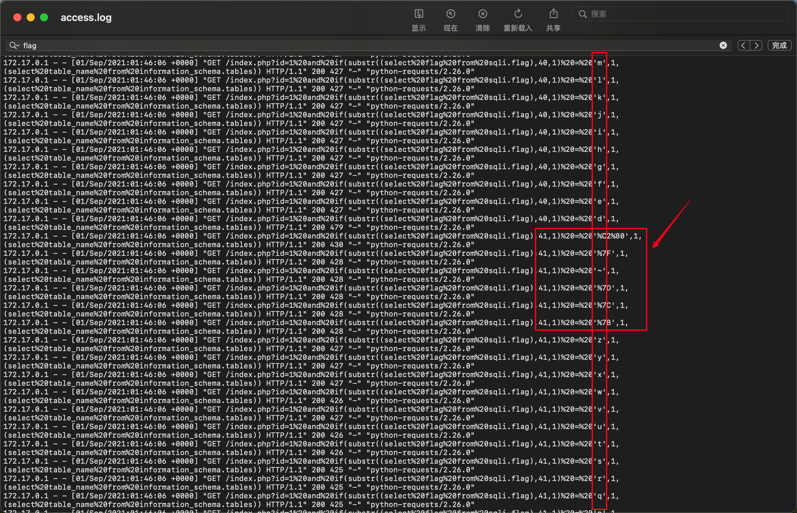

- 接着我们用py代码筛选出这样格式的行

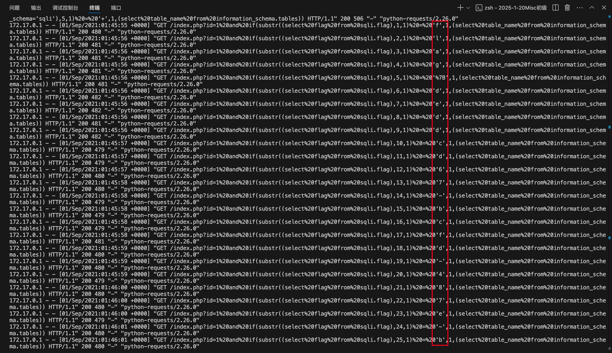

- 最后整理得到flag

### 6.3 解题答案

NSSCTF{deddcd67-bcfd-487e-b940-1217e668c7db}